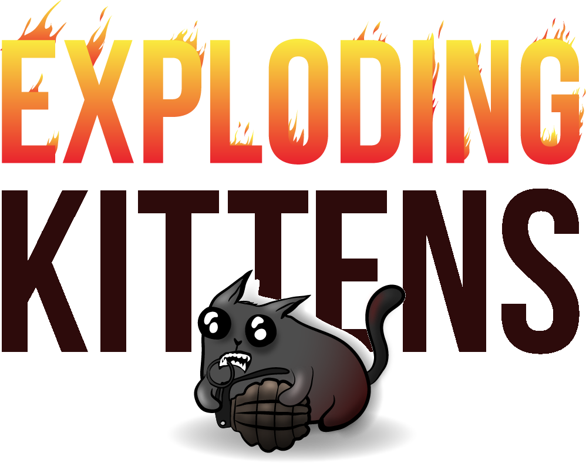
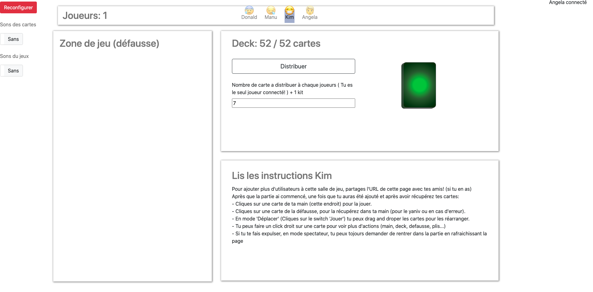
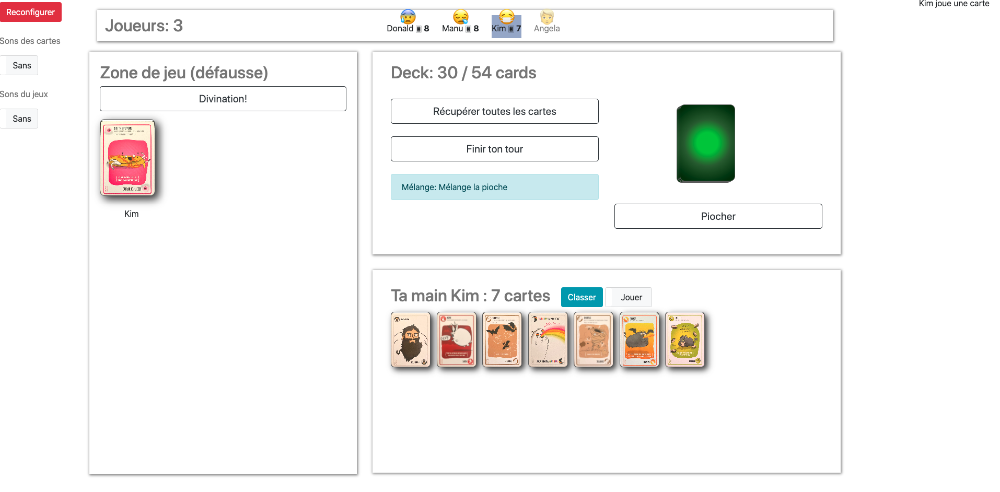

# Virtual Deck Of Cards (exploding edition)

A virtual deck of cards! Play anything anywhere, with anyone!

This branch is for the Exploding Kittens card game
If you want to play with a normal deck of cards go to master branch

Covid-19 is here, you are lockdown at home and want to play remotely with your friends ?

Fear no more, as the virtual deck of exploding kittens cards is here! Simply create room and play with your friend.

Current supported Languages: English, French

[Original game rules](https://explodingkittens.com/how-to-play/exploding-kittens)

# What's new 
- add webRTC audio / video chat. To test if your browser is compatible check here https://test.webrtc.org/
- Fix nope issue : if I nope a nope I should be ablet to do the action

# What you can currently do
- Play card from hand
- Proper distribution from EK (without kittens and by giving a kit to each player)
- Exploding kittens original deck
- Specific EK distribution with kits and exploding kittens aside

- Availble actions (all from original game):
  - attack
  - shuffle
  - explode
  - defuse
  - favor
  - steal a card (combo 2 card)
  - See the future

- from imploding (wip):
  - reverse
  - draw from the bottom

# What's in progress
imploding kittens extentions
  - imploding (1)
  - inversion (4) DONE
  - revirement (4) DONE
  - chat gouttière (4)
  - alteration du future (4)
  - attaque ciblée

# What's next   
- Check translations
- Add extentions
  - streaking kittens
  - barking kittens

# Screenshot

# Bugs

 ---

# How to play locally

### 1)  Install Node JS 

Follow for your platform instruction [here](https://nodejs.org/en/download/package-manager)

### 2) Clone repository

in a console:

> git clone https://github.com/ghostwan/Virtual-Deck-Of-Cards.git

### 3) Start node package 

in a terminal open where you cloned the virtual deck and then

> npm start

or the startup script

> ./start.sh

### 4) Open a navigator

> http://localhost:3000/

Use computer private ip to connect on local network from other computers.

# How to play remotely with your friends

## Deploy on Heroku

Heroku is a platform as a service (PaaS) that enables developers to build, run, and operate applications entirely in the cloud.  
It as a free plan enough for this app needs.

**Warning Heroku free plan servers can idle after sometime which will result in a game loss!**

https://www.heroku.com/

### 1) Install CLI

Follow for your platform instruction [here](https://devcenter.heroku.com/articles/getting-started-with-nodejs#set-up)

### 2) Get Heroku logs

> heroku logs -t -a project_name

### 3) Deploy the app

https://devcenter.heroku.com/articles/getting-started-with-nodejs#deploy-the-app

## Use a tunnel to your local server

You can use tunnel as [ngrok](https://ngrok.com/). See [tunnel.sh](tunnel.sh).  
After creating an account, [configure you computer](https://dashboard.ngrok.com/get-started/setup) 
and putting ngrok in your path.

In a terminal start your local server:
> ./start.sh

And then in another terminal start the tunnel: 
> ./tunnel.sh

---

# Credits

You can fork this repository as long as you respect the Licence, credit me and other contributors.

## Code base 

This project is a fork of [Jing Xuan](https://github.com/jing-xuan) 
project [Virtual-Deck-Of-Cards](https://github.com/jing-xuan/Virtual-Deck-Of-Cards)

## Cards in CSS

Fork of [CSS-Playing-Cards](https://github.com/selfthinker/CSS-Playing-Cards) 

@author Anika Henke anika@selfthinker.org
@license CC BY-SA [http://creativecommons.org/licenses/by-sa/3.0]
@version 2011-06-14
@link http://selfthinker.github.com/CSS-Playing-Cards/

## Game sounds

From [Zapsplat.com](https://www.zapsplat.com/)

## Menu icons

From [font awesome](https://fontawesome.com/)

## Translation framework 

With [i18next](https://www.i18next.com/) and all its contributors.

## Other Server / Client librairies

Use of :
- [Node JS](https://nodejs.org/en/) for server side.
- [Socket.IO](https://socket.io/) for server / client communication.
- [Bootstrap](https://getbootstrap.com/) for client side
- [Bootstrap toggle](https://gitbrent.github.io/bootstrap4-toggle/) for toggle rendering.
- [jQuery](https://jquery.com/) for dom manipulation.
- [jQuery Menu](https://swisnl.github.io/jQuery-contextMenu/) for right click menus.
- [jQuery UI](https://jqueryui.com/) for UI interacrions.
- [Popper.js](https://popper.js.org/) for positioning.
- [Foreach](https://github.com/toddmotto/foreach) for object iteration.