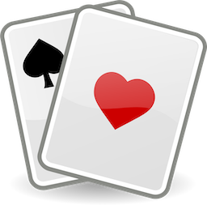
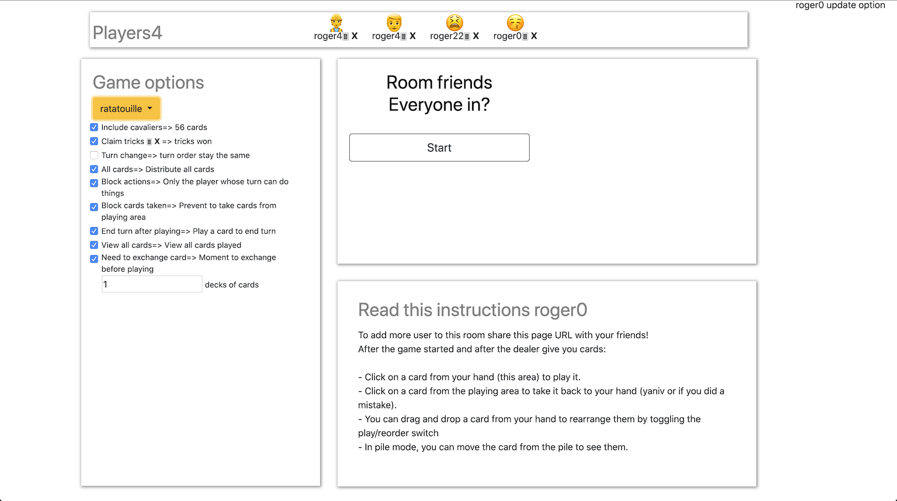
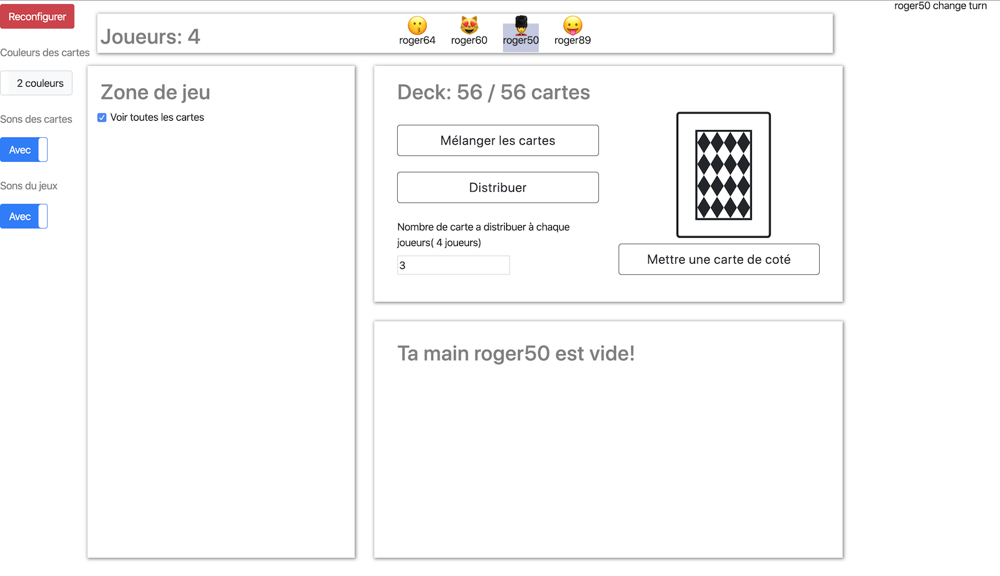
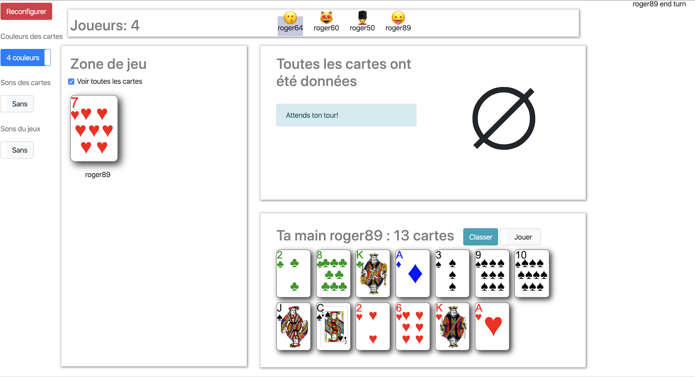
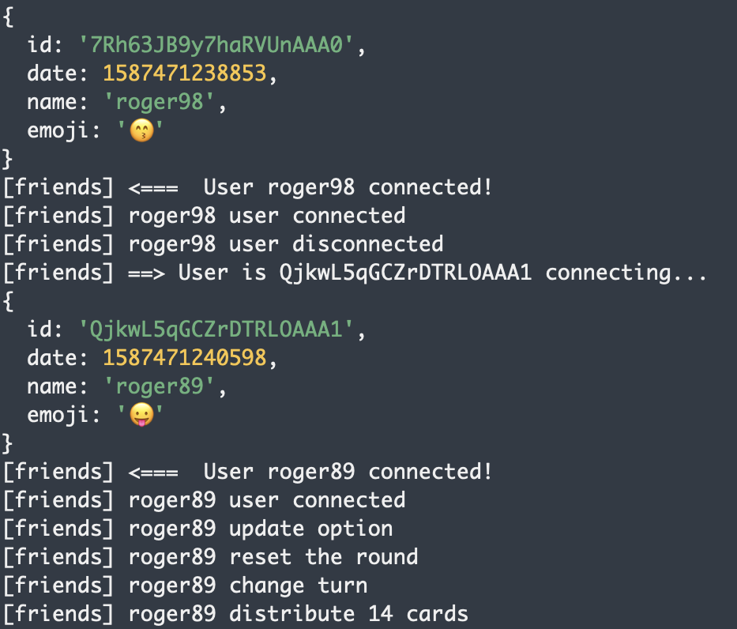

# Virtual Deck Of Cards

A virtual deck of cards! Play anything anywhere, with anyone!

You are a fan of cards game as :
- [Yaniv](https://www.wikiwand.com/en/Yaniv_(card_game))
- [Ascenseur](https://www.wikiwand.com/en/Oh_Hell)
- Escalier
- [Barbu](https://www.wikiwand.com/en/Barbu_(card_game))
- Ratatouille
...

Covid-19 is here, you are lockdown at home and want to play remotely with your friends ?

Fear no more, as the virtual deck of cards is here! Simply create or sign into a deck, and play any game with anyone.

Current supported Languages: English, French

# What you can currently do
- Create a room to play any cards game with your friends!
- Share the room's url to invite people into the game!
- See who's connected to the room
- Choose your name roger!
- Configure deck, game pre config, options...
- Put a visible card aside for game as "oh hell"
- Take the card put aside for game as "yaniv"
- Distribute the whole deck or a specific number of cards among all players 
- See how many cards each player got
- Rearrange cards in your hand, sort them by suit, by values, shuffle them! you name it! 
- See who's turn is and change it if needed (choose a specific player or random)
- Draw a card from the deck
- Play a card from your hand
- Take a card from the playing area (for some game as Yaniv or if you did a mistake)
- Hide cards values in playing area (poker style ;) ) 
- See who played a card
- Clear the playing area
- Add the end display people hands
- Option to claim trick and see who won tricks
- Option for preparation phase to exchange card for example (Hide values, put all cards on the table and ask someone to pick one)
- Option to block players actions when it's not there turn (to prevent chaos =) )
- Option to end turn after playing a card
- Option to block card retrieving from playing area (game with trick don't need it)
- Option to display 4 colors for your cards
- Option to play sound for a more realistic party
- Option for the number of deck to play with
- Translation (browser detection or query parameter 'lang') default is english.

# What's new 

- Get and shuffle discard pile
- Pile up / disperse card in pile
- French translation for figures
- TAROT - Add trumps cards (atouts) for tarot
- TAROT - Add option to put hidden cards aside 
- TAROT - Add card aside to the pile
- Sort by value
- Increase / decrease card size
- TAROT - Give card from trick

# What's next 

- TAROT - montrer les plis des gens
- GAME PLAY - ne faire transiter vers les clients les mains que quand on veut les afficher
- GAME PLAY - Locker la partie pour que plus personnes ne puisse rentrer 
- GAME PLAY - ESCALIER - Prise en compte des annonces
- GAME PLAY - MARMOTEE - poser des cartes cacher sur la table
- GAME PLAY - Quand quelqu'un se connecte lui permettre ou non de rejoindre la partie, sinon spectateur
- GAME PLAY - Gestion des scores
- GAME PLAY - Créer de nouvelles cartes entre 10 et valet quand on est plusieurs (11, 12, 13, 14, 15...)
- UX - Chat écrit
- UX - Chat oral / video
- UI - Revoir l'ecran d'appel

# Bugs

- Si on distribue plus de cartes que de personnes ça foire les comptes
- Cartes disparut => prendre cette cartes

# Game features status

| Features / Games                      | Escalier [D] | Ratatouille [D] | Yaniv  [D] | Tarot   [D] | Poker [W] |
| ------------------------------------- | ------------ | --------------- | ---------- | ----------- | --------- |
| Distribute all the deck               |              | OK              |            | OK          |           |
| Distribute a specific number of cards | OK           |                 | OK         |             | OK        |
| Put a card aside                      | OK (atout)   |                 |            |             |           |
| Claim trick                           | OK           | OK              |            | OK          |           |
| See How many cards each player got    |              |                 | OK         |             |           |
| Draw a card from the deck             |              |                 | OK         |             |           |
| Take a card from the playing area     |              |                 | OK         |             |           |
| Change turn automatically             | OK           |                 |            |             |           |
| Display trick won                     |              | OK              |            | OK          |           |
| Log actions                           |              |                 | OK         |             |           |
| Random first player                   | OK           | OK              | OK         |             |           |
| Put old cards in discard pile         |              |                 | OK         |             |           |
| Shuffle the discard pile              |              |                 | OK         |             |           |
| Trump cards (atouts)                  |              |                 |            | OK          |           |
| ------------ TO DEVELOP ------------  |              |                 |            |             |           |
| Bidding                               | OPTIONNAL    |                 |            |             | NEED      |
| Scores calculator                     | OPTIONNAL    | OPTIONNAL       | OPTIONNAL  | OPTIONNAL   |           |
| Recall the round rules                |              | OPTIONNAL       |            |             |           |

D = DONE: you can play easily to this game  
N = NOT OPTIMAL: you can play but it's not optimal features are missing  
W = WIP:  you can't currently play important features are missing  
T = TODO: Most of the minimum needed features to play are missing  
 

 ---

# How to play locally

### 1)  Install Node JS 

Follow for your platform instruction [here](https://nodejs.org/en/download/package-manager)

### 2) Clone repository

in a console:

> git clone https://github.com/ghostwan/Virtual-Deck-Of-Cards.git

### 3) Start node package 

in a terminal open where you cloned the virtual deck and then

> npm start

or the startup script

> ./start.sh

### 4) Open a navigator

> http://localhost:3000/

Use computer private ip to connect on local network from other computers.

# How to play remotely with your friends

## Deploy on Heroku

Heroku is a platform as a service (PaaS) that enables developers to build, run, and operate applications entirely in the cloud.  
It as a free plan enough for this app needs.

**Warning Heroku free plan servers can idle after sometime which will result in a game loss!**

https://www.heroku.com/

### 1) Install CLI

Follow for your platform instruction [here](https://devcenter.heroku.com/articles/getting-started-with-nodejs#set-up)

### 2) Get Heroku logs

> heroku logs -t -a project_name

### 3) Deploy the app

https://devcenter.heroku.com/articles/getting-started-with-nodejs#deploy-the-app

## Use a tunnel to your local server

You can use tunnel as [ngrok](https://ngrok.com/). See [tunnel.sh](tunnel.sh).  
After creating an account, [configure you computer](https://dashboard.ngrok.com/get-started/setup) 
and putting ngrok in your path.

In a terminal start your local server:
> ./start.sh

And then in another terminal start the tunnel: 
> ./tunnel.sh

---

# Credits

You can fork this repository as long as you respect the Licence, credit me and other contributors.

## Code base 

This project is a fork of [Jing Xuan](https://github.com/jing-xuan) 
project [Virtual-Deck-Of-Cards](https://github.com/jing-xuan/Virtual-Deck-Of-Cards)

## Cards in CSS

Fork of [CSS-Playing-Cards](https://github.com/selfthinker/CSS-Playing-Cards) 

@author Anika Henke anika@selfthinker.org
@license CC BY-SA [http://creativecommons.org/licenses/by-sa/3.0]
@version 2011-06-14
@link http://selfthinker.github.com/CSS-Playing-Cards/

## Game sounds

From [Zapsplat.com](https://www.zapsplat.com/)

## Menu icons

From [font awesome](https://fontawesome.com/)

## Translation framework 

With [i18next](https://www.i18next.com/) and all its contributors.

## Other Server / Client librairies

Use of :
- [Node JS](https://nodejs.org/en/) for server side.
- [Socket.IO](https://socket.io/) for server / client communication.
- [Bootstrap](https://getbootstrap.com/) for client side
- [Bootstrap toggle](https://gitbrent.github.io/bootstrap4-toggle/) for toggle rendering.
- [jQuery](https://jquery.com/) for dom manipulation.
- [jQuery Menu](https://swisnl.github.io/jQuery-contextMenu/) for right click menus.
- [jQuery UI](https://jqueryui.com/) for UI interacrions.
- [Popper.js](https://popper.js.org/) for positioning.
- [Foreach](https://github.com/toddmotto/foreach) for object iteration.